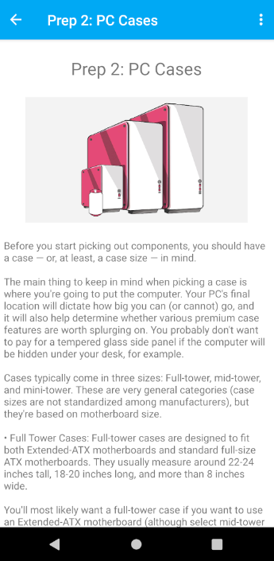

# HonoursProject
This is my repostitory for my honours project. It served as a backup of my development of the project. As such commit history will be messy and rough. 

The project is an attempt of making a native andorid app in order to learn more about NoSQL databases and working with one (in this case Firestore).

<b>The database has been taken offline so the app will not function as inteded. Instead you can get an idea of what the app is like from the images included below or in the images directory. 

 &nbsp;&nbsp;  &nbsp;&nbsp; 

 &nbsp;&nbsp;  &nbsp;&nbsp; 
  
 &nbsp;&nbsp;  &nbsp;&nbsp; 
